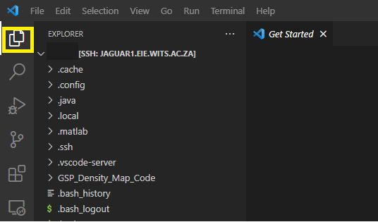

# High-Performance Computing Cluster (HPC) Connection Guide

# TOC


# 1. Introduction

Attached to accessing superior resources, other benefits of remote development include mobility of access and the ability to use any device to access the remote development (remote-dev). This guide helps you get started with remote development on the EIE cluster with Debian/Ubuntu environment as the host OS. While this tutorial covers VS Code, you can use any editor (or IDE) with remote-dev capabilities. Links to doc sites to some of the common editors are provided at the end of tutorial.

&nbsp;

# 2. Remote-Dev: Windows Guide (10 & 11)

## 2.1 Requirements

- Login Credentials
- Operating System (OS): Windows 10/Later
- VS Code: [Official Site](https://code.visualstudio.com)
- OpenSSH Client ( Available in features )
- Local Extensions: [Remote-SSH](https://marketplace.visualstudio.com/items?itemName=ms-vscode-remote.remote-ssh), [Remote - SSH: Editing Configuration Files](https://marketplace.visualstudio.com/items?itemName=ms-vscode-remote.remote-ssh-edit). These can easily be installed by accessing the extensions market place icon on the menu on the left side-pane.

&nbsp;

## 2.2 Setup

### 2.2.1 VS-Code Installations

Visit the VSCode [Official Site](https://code.visualstudio.com) and download the installer. Install the _".exe"_ file upon successful download.


### 2.2.2  Installation of Open SSH

> - Open **Settings**, select **Apps**, then select **Optional Features**
> - Scan the list to establish if **OpenSSH**server and client), is installed.
> - If not, Add a feature, and:
>   * Find **OpenSSH Client**, then select and Install.
>   * Find **OpenSSH Server**, then select and install.

&nbsp;

## 2.3 Remote Connections

### 2.3.1 Connect to OpenSSH Server

Once OpenSSH has been installed, you can connect to OpenSSH Server (On
HPC Cluster) from an OpenSSH Client (On your local machine) using
windows cmd or PowerShell as follows:-

` >ssh domain\\username\@servername`

cluster Login Node servername is `jaguar1.eie.wits.ac.za`

> 

Enter yes to add the server to the list of known servers

> 

Enter your password. As a security measure, your password will not be
shown. Once successfully connected, you will see the specifications of
the cluster.

> 

The server [Jaguar1.eie.wits.ac.za](jaguar1.eie.wits.ac.za) is a login node, to access a
particular computation node you will need to further establish a
connection as per the below example.

`ssh domain\\username\@servername`

`example cluster Node servername is [192.168.1.103](192.168.1.103) `

After entering the password, access to the node will be established as
shown below.

> 

&nbsp;

## 2.4  Visual Studio Code

### 2.4.1 Open Visual Studio Code and add the Remote  
Open Visual Studio Code and add the [Remote-SSH](https://marketplace.visualstudio.com/items?itemName=ms-vscode-remote.remote-ssh) extension by
selecting extensions (`Ctrl+Shift+X`), searching Remote-SSH, and
installing the extension.

> 

After installing the [Remote-SSH](https://marketplace.visualstudio.com/items?itemName=ms-vscode-remote.remote-ssh) extension, a Remote Status Bar will
appear on the far left as shown below:

> 

&nbsp;

### 2.4.2  Test Visual Studio Code SSH connection

Click on the Remote Status Bar, follow this by clicking on *Remote-SSH:Connect to Host...* as below:

> 

Connect to the cluster using the `\username\@servername` as detailed in #Section 1.3.1 above and a new window will pop up. On the new window, Visual Studio Code will be connected to the Cluster Login Node with the Remote Status Bar as shown below.

> 

To explore the remote cluster folder structure of your home directory, click Explore on the side panel or press the corresponding shortcut keys (`Ctrl+Shift+X`). This
option allows the user to drag and drop files between the local
machine and the cluster.

> 

&nbsp;

## 2.5 SSH Authentication Using Keys (Passwordless Login to Cluster)

### 2.5.1 Generate an SSH Key Pair

Open cmd prompt and enter the following command:
 
```cmd
>ssh-keygen -t rsa
```

Press enter to accept the default directory as the location of the
keys enter a passphrase or leave the passphrase empty for the default for
_'no passphrase'_.

> 

This will generate the ***id_rsa***  file which contains the private
key the ***id_rsa.pub*** which contains the public key.

&nbsp;

### 2.5.2 Upload Public Key to Remote Cluster

Check if .ssh directory already exists on the cluster by using the folllowing command:  `ls .ssh` .

If it does not exist, create the folder by issuing the following command: `mkdir -p .ssh`. With this setting, the public key can then be uploaded onto the clusters and authorized. To achieve this, the `scp` command is issued from the local machine as follows:

```shell 
scp .ssh/id_rsa.pub server\@somedomain:\~/.ssh/authorized_keys
```

In the command above, the public key of interest is also *authorized* in the upload command.

&nbsp;

## 2.5.3  Configuration File

Connecting to the remote cluster and having to deal with password prompts to establish each session may prove to be a tedious process. This can be addressed by setting up SSH configuration settings using a _config_ file. To this end, open VS-Code and create a configuration file by clicking the remote status bar and
selecting the configuration file as shown below:


```config
Host jaguar1
  HostName jaguar1.eie.wits.ac.za           # Login Node server name
  user username                               # your username
  IdentityFile C:/users/username/.ssh/id_rsa  # Location of private key

Host gpu-node
  HostName 192.168.1.103             # gpu-node server name
  user username                      # your username
  ProxyCommand ssh -W %h:%p jaguar1
```

&nbsp;&nbsp;&nbsp;

# 3. Remote Dev: Linux (Ubunutu & Debian)

## 3.1 Requirements

- Login Credentials,
- Operating System (OS): Ubuntu/Debian Distro,
- VS Code: [Official Site](https://code.visualstudio.com),
- OpenSSH client (  `sudo apt-get install openssh-client` ),
- Local Extensions: [Remote-SSH](https://marketplace.visualstudio.com/items?itemName=ms-vscode-remote.remote-ssh), [Remote - SSH: Editing Configuration Files](https://marketplace.visualstudio.com/items?itemName=ms-vscode-remote.remote-ssh-edit). These can easily be installed by accessing the extensions market place icon on the menu on the left side-pane.

&nbsp;

## 3.2 Setup

### 3.2.1 Installation: Open SSH

To install the SSH-client, open the termina on your local machine and run the following commands:

```shell
sudo apt install openssh-client
```

&nbsp;

### 3.2.2  Installation: VS Code

The VSCode editor is installed by issuing the following commands:

```shell
sudo apt install apt-transport-https
sudo apt update
sudo apt install code # or code-insiders
```

&nbsp;

## 3.3 Remote Connections

### 3.3.1 Simple SSH Connection

#### First Connection

After installing, you should verify that you can connect to OpenSSH Server (On HPC Cluster) from an OpenSSH Client (On your local machine) the terminal. The cluster Login Node servername is identified by [jaguar1.eie.wits.ac.za](jaguar1.eie.wits.ac.za). To make the first connection, issue the following command, replacing _username_ with your login credential username:

```shell
ssh username@jaguar1.eie.wits.ac.za
```

When prompted to add the login node server the list of known servers, enter _yes_. You should be prompted for the password associated with your cluster account. Upon successful authentication, you should have access to the terminal on the remote cluster as with the sample below:

![Jaguar Term][jaguarTerm]

The server `jaguar1.eie.wits.ac.za` is a login node, to access the computation node that is equipped with the development environment, you will need to further establish a connection as shown below (from [jagaur1](jaguar1.eie.wits.ac.za) - the terminal console accessed in the previous step ):

```shell
ssh username@192.168.1.103
```

After entering the password, access to the computation node will be confirmed by a terminal session in GPU-Node server [192.168.1.103](192.168.1.103), similar to the one displayed above.

&nbsp;

### 3.3.2 Test VSCode Remote-SSH Connection

To test the SSH connection on VS Code, press `(Ctrl+Shift+P)` to open the command bar, then search "Remote-SSH" and select _"Remote-SSH: Connect to host"_ from the list that appears. This will prompt for a command; enter the following `ssh username@jaguar1.eie.wits.ac.za` as shown below:


Enter the password on prompt and connect to the server, this should grant access to the server directory. To explore the remote cluster folder structure of your home directory, click Explore on the side panel or press the corresponding shortcut keys `(Ctrl+Shift+E)`. This option allows the user to drag and drop files between the local machine and the cluster.

&nbsp;

## 3.4 Authentication Using Keys ( Passwordless Connection )

So far, setting up an SSH connection via shell or VSCode's command bar requires password authentication for each session. Considering the required frequency and persistence of connectsion, this approach may prove to be tedious. Authenticating using SSH-Keys introduces the convenience of circumventing password authentication required for every SSH session.

&nbsp;

### 3.4.1 Generating an SSH Key Pair

The key pair can be generated on the local machine. This can be achieved using the following commands in the terminal:

```shell
# If there is no .ssh/ folder, this can be created using the following command. 
mkdir ~/.ssh

# generate keys in the .ssh/ folder
cd  ~/.ssh/
~/.ssh-keygen -b 4096 -t rsa
```

An 'enter a passphrase' will be displayed. This is used to protect your private key in case someone gains access to the machine/account where you have it stored. This can be left blank and it is generally not necessary. The sequence of prompts as shown in the figure below will be displayed:


This will generate the id_rsa  file which contains the private key the  id_rsa.pub which contains the public key as can be seen in the folder structure.

&nbsp;

### 3.4.2 Uploading Public Key To Cluster

The public key can be uploaded to the cluster by dragging the '.pub' file to the remote cluster folder structure (specifically the ~/.ssh folder) after a successful ssh connection on VS-code. Alternatively, the upload can be done on the terminal by issuing the following commands:

```shell
export USER_AT_HOST="username@jaguar1.eie.wits.ac.za"
export PUBKEYPATH="$HOME/.ssh/id_rsa.pub"

ssh-copy-id -i "$PUBKEYPATH" "$USER_AT_HOST"

```

&nbsp;

### 3.4.3 Authorize Public Key

Upon upload, run the following commands to *authorize* the public key in the remote server terminal:

```shell
cd ~/.ssh   # if you are not already in the directory
touch authorized_keys
cp -a authorized_keys authorized_keys.bak   # (Optional) Back-up the authorized_keys file
cat  ./id_rsa.pub >> authorized_keys

# Correct Folder and File Permissions on the remote server
chmod 700 ~/.ssh
chmod 600 ~/.ssh/authorized_keys
```

An alternatively, the public key can be authorized by copying the contents of the public key into the 'authorized_keys' file using text editors like *nano* or *vim*.

&nbsp;

### 3.4.4 Configuration File

After authorizing the public key on the remote server, the next step is to add the remote cluster connection configurations. In VS Code on the local machine, run Remote-SSH: Open Configuration File... in the Command Palette, using `(ctrl + shift + P)`, select the _SSH config file_ option, and add (or modify) to add the relevant host entries. Generally, a host entry configuration in the _config_ file is as follows:

```config

Host name-of-ssh-host-here
    HostName host-fqdn-or-ip-goes-here
    User your-user-name-on-host
    IdentityFile /path/to/private-key or ProxyCommand

```

&nbsp;

For access to the wits cluster, add the following configurations accordingly:

```config
# Config File: ~/.ssh/config

# Login node/server. Functions as proxy server
Host jaguar1
    HostName jaguar1.eie.wits.ac.za         # Login node/server name
    User user                               # your username
    IdentityFile ~/.ssh/id_lin_rsa          # Location of private key
  
# Development Environment Node  
Host gpu-node
    HostName 192.168.1.103                  # dev server name
    User user                               # your username
    ProxyCommand ssh -W %h:%p jaguar1       # ssh proxy command through the jaguar1 server

```

&nbsp; &nbsp;

# 4. Troubleshooting & Docs References

* [Remote Development Using SSH](https://code.visualstudio.com/docs/remote/ssh)
* [Remote Development Tips and Tricks](https://code.visualstudio.com/docs/remote/troubleshooting#_configuring-key-based-authentication)
* [Old Dominion Uni | Remote Development](https://www.cs.odu.edu/~zeil/cs252/latest/Public/remoteDev/)
* [How To Use Visual Studio Code for Remote Development via the Remote-SSH Plugin](https://www.digitalocean.com/community/tutorials/how-to-use-visual-studio-code-for-remote-development-via-the-remote-ssh-plugin#step-2-configuring-the-remote-ssh-plugin-and-connecting-to-your-server)
* [Remote development server with the Editor of your choice](https://medium.com/@antonkrinitsyn/remote-development-server-with-editor-of-your-choice-47f8235c835d)
* [Remote on a remote server | Matttrent.com](https://matttrent.com/remote-development/)


[jaguarTerm]: /Pictures/jaguarTerminal.png
